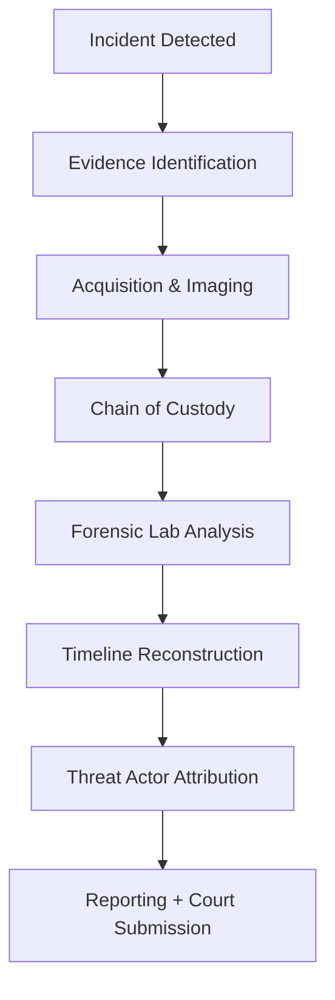

# Digital Forensics – Comprehensive Professional Guide

Digital Forensics is a specialized discipline within cybersecurity responsible for the identification, acquisition, preservation, examination, and interpretation of digital evidence. It enables investigators, security teams, and law enforcement agencies to understand cyber incidents, reconstruct events, and attribute malicious activity to specific actors.

---

## ▪ 1. Evolution of Digital Forensics

The field emerged in the 1990s as computer systems became widely used, and with time expanded into multiple domains including mobile forensics, cloud forensics, network traffic analysis, and memory-level live response. Digital Forensics is now considered a core component of Incident Response and National Cyber Defense.

---

## ▪ 2. Expanded Objectives

- Maintain evidence integrity through standardized procedures.
- Rebuild attack paths and timeline reconstruction.
- Identify TTPs (Tactics, Techniques, Procedures) of threat actors.
- Support law enforcement & provide court-admissible evidence.
- Enable organizations to improve long-term cyber resilience.
- Provide factual intelligence for cyber threat attribution.

---

## ▪ 3. Types of Digital Evidence

| Evidence Type | Examples | Forensic Value |
|---|---|---|
| Disk Evidence | NTFS, EXT4 partitions, deleted files | High-value persistent data |
| Volatile Evidence | RAM, live sessions, encryption keys | Critical for malware & ransomware |
| Network Evidence | PCAP traffic, Netflow logs, DNS queries | Helps track attacker movement |
| Cloud Evidence | S3 logs, Azure AD auth trails | Multi-tenant complexity |
| Application Evidence | DB logs, API access audit | User action attribution |
| Mobile Evidence | WhatsApp logs, GPS data | Social interaction visibility |

---

## ▪ 4. Chain of Custody (Critical Compliance Requirement)

A valid investigation **must** maintain:

1. Evidence captured without modification  
2. Documented transfer of custody with signature history  
3. Secure storage with hashing for verification  
4. Reproducibility in court under ISO/NIST guidance  

Example Documentation Format:

| Step | Handler | Date/Time | Hash Value | Notes |
|---|---|---|---|---|
| Acquisition | Investigator #1 | 2025-02-10 14:33 | SHA-256: 83ADA... | Full disk image captured |
| Transfer | Lab Custodian | 2025-02-10 15:10 | Verified identical | Sealed and archived |

---

## ▪ 5. Advanced Tools & Suitability Matrix

| Tool | Best Use Case | Strength Level |
|------|----------------|----------------|
| EnCase | Corporate disk analysis | Enterprise-grade |
| FTK | Indexing large data sets | High speed |
| Autopsy | Open-source field work | Cost-effective |
| X-Ways | Deep low-level forensic analysis | Specialist tool |
| Cellebrite UFED | Mobile extraction | Law enforcement standard |
| Magnet AXIOM | All-in-one desktop/mobile | Modern interface |
| Volatility | Memory dumps + malware | Critical in ransomware |
| Wireshark | Network packet inspection | Network incident analysis |
| Ghidra | Reverse engineering malware | Free alternative to IDA Pro |

---

## ▪ 6. Digital Forensics Lab Platforms

| Platform | Strength |
|----------|----------|
| SANS DFIR Workstation | Enterprise-grade DFIR pipeline |
| REMnux | Malware & RE-focused toolkit |
| CAINE OS | Portable investigation field kit |
| Kali DFIR Edition | Red/Blue hybrid environment |
| AWS / Azure Forensics Lab | Cloud-native response environments |
| Magnet AXIOM Cloud Suite | Evidence correlation across devices |

---

## ▪ 7. Challenges and Future Trends

- Increasing cloud-native attacks and multi-tenant evidence handling complexity  
- Encrypted storage and mandated privacy environments  
- AI-generated attacks requiring behavioral forensics  
- Nation-state threat attribution becoming legally sensitive  
- Quantum-era cryptographic implications on evidence recovery  

Digital Forensics will evolve into **adaptive forensic intelligence**, where automated DFIR engines and machine-learning anomaly profiling support investigators with predictive forensics.

---

## ▪  Digital Forensics Workflow

# Digital Forensics Workflow – Detailed Explanation

## 1. Incident Detected (A)
This phase begins when suspicious activity is observed or an alert is triggered by security systems such as SIEM, EDR, or intrusion detection tools. The objective is to confirm that a security incident has occurred and initiate the forensic response.

---

## 2. Evidence Identification (B)
Investigators identify all potential sources of digital evidence. This includes systems involved in the attack, log sources, cloud artifacts, memory data, and user accounts. The goal is to determine what evidence must be collected before it is lost or altered.

---

## 3. Acquisition & Imaging (C)
Evidence is collected using forensically sound methods:
- Full disk imaging (bit-by-bit)
- Memory acquisition
- Log extraction
- Network capture retrieval
- Cloud service evidence collection

Original data is never modified. All analysis is performed on verified forensic copies.

---

## 4. Chain of Custody (D)
A formal, legally recognized documentation process that ensures evidence integrity. It records:
- Who collected the evidence  
- When, where, and how it was collected  
- Transfer history between handlers  
- Storage location and handling conditions  
- Hash values (SHA-256/512) confirming data integrity  for evidence

Maintaining a proper chain of custody ensures evidence remains admissible in court.

---

## 5. Forensic Lab Analysis (E)
Forensic specialists analyze the evidence in a controlled laboratory environment using tools such as:
- EnCase  
- FTK  
- Autopsy  
- X-Ways  
- Volatility  

Key tasks include:
- File system analysis and recovery  
- Log and registry examination  
- Memory and malware analysis  
- Identifying attacker activities  and TTPs

---

## 6. Timeline Reconstruction (F)
All timestamps, logs, artifacts, and events are correlated to rebuild a complete chronological timeline of the incident. Investigators identify:
- Initial compromise vector  
- Malware execution  
- Privilege escalation  
- Lateral movement  
- Data exfiltration or manipulation  

The timeline explains **what happened, how it happened, and when it happened**.

---

## 7. Threat Actor Attribution (G)
Investigators attempt to determine who carried out the attack using:
- Tactics, techniques, and procedures (TTPs)  
- Indicators of Compromise (IOCs)  
- Network and infrastructure analysis  
- Malware signatures and coding patterns  
- Behavioral correlation with known APT groups  

Attribution may be:
- Technical  
- Operational  
- Strategic (national-level)  

---

## 8. Reporting + Court Submission (H)
A comprehensive forensic report is prepared, including:
- Executive summary  
- Scope and objectives  
- Evidence acquisition details  
- Analysis findings  
- Full incident timeline  
- Screenshots, logs, and hash values  
- Legal appendix for court submission  

The final report must be accurate, defensible, and understandable by non-technical personnel (judges, lawyers, executives).

## Final Summary

Digital Forensics is no longer a reactive capability — it is a national defense asset.  
When supported by strong legal frameworks, modern forensic tooling, and cloud-DFIR competencies, organizations can achieve full cyber visibility and evidence-grade resilience.
